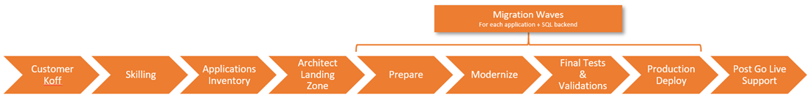

# FastTrack for Azure - App Migration

This repo contains advice, links and resources for engineers who are working on App Migration projects in Azure. 

👷🏻‍♀️🚧👷🏻‍♂️ (WIP)

## About FastTrack for Azure

## About Azure Migration Program for .NET

## Migration checklists

 _Figure: Example of Migration Phases for App Migration project_

Follow the links below to engineer guidance, checklists and task lists for each phase of migration.

#### Pre-migration

* **Kickoff** [Technical discovery checklist]
* **Skilling**
* **Application Inventory** [App inventory checklist]
* **Landing Zone** [Landing zone review]

#### Migration waves

For-each App + SQL backend:

* **Prepare** [Architecture Design Review]
* **Modernize**
    * [App mod task list]
    * [DB migration checklist]
* **Test & validate** [Test & validation task list]
* **Production deploy** [Prod deploy checklist]

#### Post-migration

* [Post go-live support checklist]

## Links & more information

## Contributing

This project welcomes contributions and suggestions.  Most contributions require you to agree to a
Contributor License Agreement (CLA) declaring that you have the right to, and actually do, grant us
the rights to use your contribution. For details, visit https://cla.opensource.microsoft.com.

When you submit a pull request, a CLA bot will automatically determine whether you need to provide
a CLA and decorate the PR appropriately (e.g., status check, comment). Simply follow the instructions
provided by the bot. You will only need to do this once across all repos using our CLA.

This project has adopted the [Microsoft Open Source Code of Conduct](https://opensource.microsoft.com/codeofconduct/).
For more information see the [Code of Conduct FAQ](https://opensource.microsoft.com/codeofconduct/faq/) or
contact [opencode@microsoft.com](mailto:opencode@microsoft.com) with any additional questions or comments.

## Legal Notices

Microsoft and any contributors grant you a license to the Microsoft documentation and other content
in this repository under the [Creative Commons Attribution 4.0 International Public License](https://creativecommons.org/licenses/by/4.0/legalcode),
see the [LICENSE](LICENSE) file, and grant you a license to any code in the repository under the [MIT License](https://opensource.org/licenses/MIT), see the
[LICENSE-CODE](LICENSE-CODE) file.

Microsoft, Windows, Microsoft Azure and/or other Microsoft products and services referenced in the documentation
may be either trademarks or registered trademarks of Microsoft in the United States and/or other countries.
The licenses for this project do not grant you rights to use any Microsoft names, logos, or trademarks.
Microsoft's general trademark guidelines can be found at http://go.microsoft.com/fwlink/?LinkID=254653.

Privacy information can be found at https://privacy.microsoft.com/en-us/

Microsoft and any contributors reserve all other rights, whether under their respective copyrights, patents,
or trademarks, whether by implication, estoppel or otherwise.

<!-- LINKS -->
[Technical discovery checklist]:./docs/discovery.md
[App inventory checklist]:./docs/app-inventory.md
[Landing zone]:./docs/landing-zone
[Architecture Design Review]:./docs/architecture-review.md
[App mod task list]:./docs/app-mod.md
[DB migration checklist]:./docs/db-migration.md
[Test & validation task list]:./docs/testing-validation.md
[Prod deploy checklist]:./docs/prod-deploy.md
[Post go-live support checklist]:./support.md
